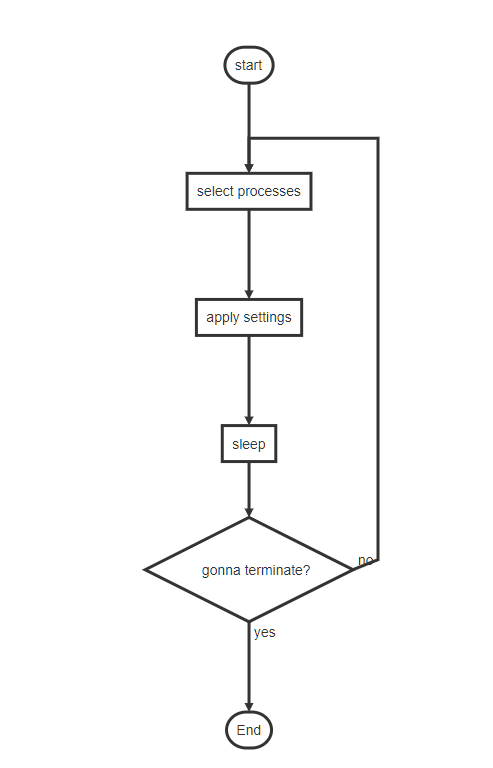

# SUPER-THREAD

or whatever, this is a simple & stupid utility to tweak affinity or some another settings of windows process and thread, with the inspire of [ProcessHacker](https://github.com/processhacker/processhacker) and [GroupExtend](https://github.com/jeremycollake/groupextend).

#### **⚠DISCLAIMER⚠**

required administrator privileges to run. this little tool which is written by a n00b with ugly code (`O(^)` inside!) basically will not damage anything, but there is absolutely no warranty, use on your own risk anyway.

#### WHY

I wrote this shit because NUMA sucks on Microsoft® Windows®, especially when there are more than 64 threads on your monster machine.

legacy programs does not support `SetThreadGroupAffinity()` API, in other words, legacy programs can only utilize one single processor group, not the all threads available on system. well, with this tool, you may be able to override this, span threads of legacy program across all processor groups. for example, `vmware workstation 16`, cannot assign CPU threads to multiple processor groups out of box, with this tool, it may overcome that.

some devices like GPU may only be assigned to one specified CPU, and windows properly launches program which interacts with GPU a lot (yes, games) to opposite CPU. I hate to set affinity for them in task manager over and over. and `ProcessHacker` or `ProcessExp` (sysinternal suits) cannot assign group affinity, so I wrote one. 

#### TECHNICAL DETAILS

⚠ undocumented Windows behavior, take a grain of salt while reading.

Windows may schedule things with thread as minimal entity.

If a thread has ever called `SetThreadGroupAffinity()`, then the process it belongs to cannot set `process affinity` in task manager anymore, so let's call that process is threaded. that's why some processes can not set affinity in task manager sometimes.

isn't there a API named `SetProcessGroupAffinity()`? yes, and meanwhile, no. there are two APIs named like that in MinGW header, but both of them are stump. starting with Win10, I believed, task manager can directly change process group affinity, there are definitely some APIs can change process group directly. disassembling the taskmgr.exe, and those hidden API were disclosed.  

so when a process is not threaded, this tool call hidden API to set process group affinity. but in practice, after calling multiple times of hidden APIs, even `GetProcessGroupAffinity()` only, process will turn in to a threaded process, those hidden APIs do not work anymore on it.

things come to thread level, when a threaded process creates a new thread with no group affinity specified, group affinity of new thread properly is set with round-robin manner.

⚠ you have to understand NUMA a bit, in some workloads, assigning threads across different CPU socket will not provide any performance benefits at all, or performance may drop due to accessing remote memory and busy socket communications.

#### OVERVIEW

this tool runs in a simple manner:

#### USAGE

`./super-thread.exe -c "path_to_json_config"`

`./super-thread.exe -h`

#### CONFIG

for details, please check `./config/config_commented.json`

* `processes` mode
  * `by_map`: all processes matched profile will be set with static group affinity provided
  
  * `node_rr`: all processes matched profile will be assigned to processor group with a round-robin manner and affinity mask provided
  * `node_randome`: all processes matched profile will be assigned to processor group randomly with affinity provided
  * `onload`: not implemented

- `threads` mode
  * `node_rr`: set all threads of processes matched profile with round-robin processor group and affinity provided
  * `node_random`: set all threads of processes matched profile with random processor group and affinity provided
  * `cpu_rr`: not implemented
  * `onload`: not implemented

#### WHAT IS BROKEN

* program may hang while querying handle of some processes, use file handle identity with caution
* system-wide file handle search is broken since may stuck on some processes
